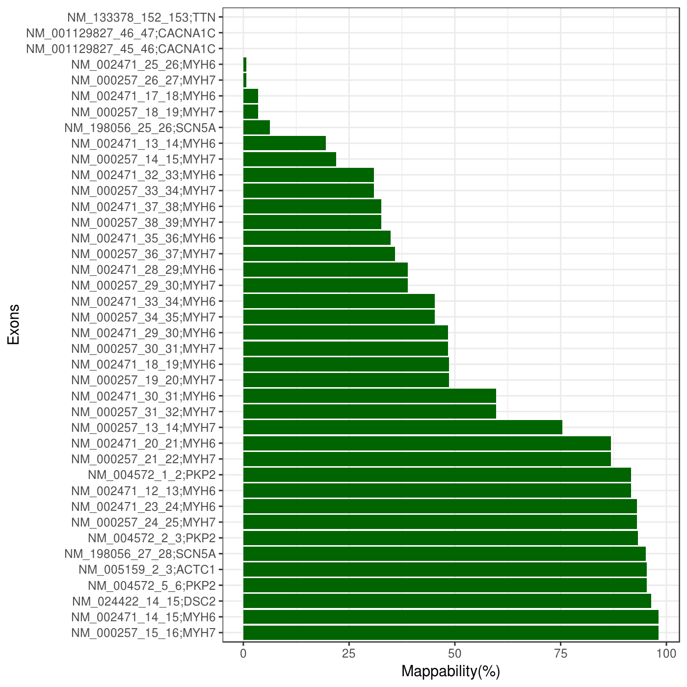

# GenePanel-Multimap
 Extract mappability scores at every exon entry.

### Dependencies
* Perl
* Perl modules: Sort::Key::Natural
* R (>= 3.3). In addition Rscript must be accessible
* ggplot2 R library
* [BEDtools](https://github.com/arq5x/bedtools2)
* [GEM-mapper](https://github.com/smarco/gem3-mapper)

### Other required files
* Genome references in FASTA format
* GEM index file

### ROI format

ROI file must contain at least four columns (tab-delimited).
The 4th column must be formated with this scheme: RefSeq_numericExonPrevious_numericExonCurrent;Gene

Example:
```
chr17	48243395	48243444	NM_000023_0_1;SGCA
chr17	48244723	48244854	NM_000023_1_2;SGCA
```
### Usage
```
perl GenePanel-Multimap.pl <Params>
```
 Params:
```
-bed    FILE   BED file of regions 
-l      INT    Bait length (default 80)
-m      INT    Maximum percentage of mismatches for mapping (default 1%)
-g      FILE   Genome file in FASTA
-ncpu   INT    Number of CPUs used for gem-mapper (default 1)
-index  FILE   PATH to GEM indexed file
-o      FILE   Output directory
```
### Low mappability plots




